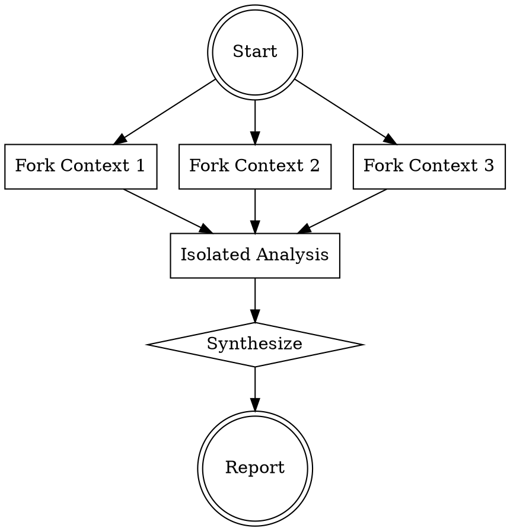

# Bookmark Analyzer

Performs multi-perspective analysis using context isolation. Fork contexts to analyze independently, then synthesize findings.

## When to Use

- Need comprehensive codebase understanding across dimensions
- Analyzing architecture, data flow, and types in one session
- Finding issues that span multiple layers (components, hooks, types)

## Analysis Workflow



## Context Fork Templates

### 1. Component Structure Analysis

**Fork scope:** `components/` directory

```tsx
// Search patterns for this fork
Search: {
  pattern: "^import.*from.*components",
  files: ["**/*.tsx", "**/*.ts"]
}
Analyze: {
  - Count total .tsx files in components/
  - Map parent-child relationships (import chains)
  - Identify shared/reused components
  - Count components per feature area
}
```

### 2. Data Flow Analysis

**Fork scope:** `context/`, `hooks/`, `lib/`

```tsx
// Search patterns for this fork
Search: {
  pattern: "(useContext|useReducer|useState|useCallback)",
  files: ["**/*.tsx", "**/*.ts"]
}
Trace: {
  - Bookmark state origin (BookmarksContext)
  - Prop drilling paths to leaf components
  - Hook dependencies and side effects
  - Storage interactions (lib/storage.ts)
}
```

### 3. Type Coverage Analysis

**Fork scope:** `lib/`, `components/`

```tsx
// Search patterns for this fork
Search: {
  pattern: "(interface|type|\\.schema\\.|z\\.)",
  files: ["**/*.ts", "**/*.tsx"]
}
Check: {
  - Untyped functions (missing return type)
  - Interface completeness (optional vs required fields)
  - Zod schema alignment with TypeScript types
  - Generic coverage in lib/types.ts
}
```

## Output Format

Return combined analysis as:

```markdown
## Component Structure
- Total components: N
- Parent-child hierarchy
- Shared components identified

## Data Flow
- State origin point
- Prop drilling depth
- Key hooks and dependencies

## Type Coverage
- Typed vs untyped functions
- Schema-type alignment issues
- Missing interfaces

## Recommendations
1. [Priority] Finding and fix
2. [Priority] Finding and fix
```

## Common Analysis Findings

| Finding Type | Typical Location | Priority |
|--------------|------------------|----------|
| Prop drilling > 2 levels | Components | Medium |
| Untyped internal function | lib/*.ts | Low |
| Missing Zod schema | validation.ts | High |
| Context not used downstream | context/ | Medium |
| Duplicate component logic | components/ | Low |

## Quick Commands

```bash
# Count components
find components -name "*.tsx" | wc -l

# Find prop drilling
grep -r "props\\." components/*.tsx | grep -v "props\\.children"

# Check type coverage
grep -r "): \\w+(" lib/*.ts | grep -v ": \\w+(" | wc -l
```
