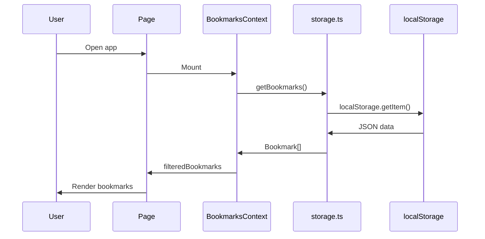
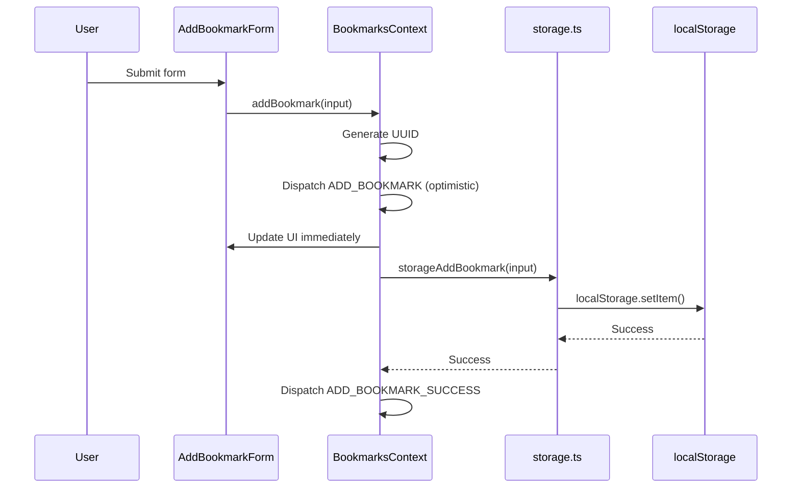
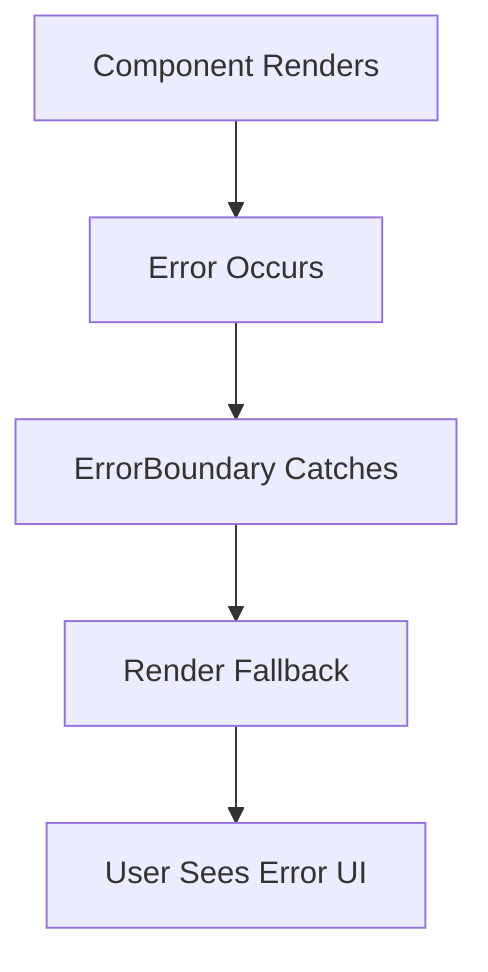

# Architecture

High-level system design and data flow documentation for Bookmark Vault.

## Overview

Bookmark Vault is a client-side Next.js application that manages bookmarks using localStorage persistence. It follows a component-based architecture with React context for state management.

```
┌─────────────────────────────────────────────────────────────┐
│                    Next.js App Router                        │
│  ┌─────────────────────────────────────────────────────┐   │
│  │                    RootLayout                        │   │
│  │  ┌─────────────────────────────────────────────┐    │   │
│  │  │           ThemeProvider                      │    │   │
│  │  │  ┌─────────────────────────────────────┐    │    │   │
│  │  │  │        BookmarksProvider             │    │    │   │
│  │  │  │  ┌─────────────────────────────┐    │    │    │   │
│  │  │  │  │         Page.tsx            │    │    │    │   │
│  │  │  │  │  ┌─────────────────────┐    │    │    │    │   │
│  │  │  │  │  │    BookmarkList     │    │    │    │    │   │
│  │  │  │  │  └─────────────────────┘    │    │    │    │   │
│  │  │  │  └─────────────────────────────┘    │    │    │   │
│  │  │  └─────────────────────────────────────┘    │    │   │
│  │  └─────────────────────────────────────────────┘    │   │
│  └─────────────────────────────────────────────────────┘   │
└─────────────────────────────────────────────────────────────┘
```

## Directory Structure

```
bookmark-vault/
├── app/                    # Next.js App Router
│   ├── layout.tsx         # Root layout with providers
│   ├── page.tsx           # Home page
│   └── globals.css        # Global styles (Tailwind)
├── components/            # React components
│   ├── Bookmark*.tsx     # Bookmark-related components
│   ├── *Form.tsx         # Form components
│   ├── ThemeToggle.tsx   # Theme switcher
│   ├── ErrorBoundary.tsx # Error boundary wrapper
│   └── __tests__/        # Component tests
├── context/               # React contexts
│   ├── BookmarksContext.tsx  # Bookmark state & actions
│   └── ThemeContext.tsx      # Theme state
├── hooks/                 # Custom React hooks
│   ├── useBookmarks.ts       # Bookmarks context hook
│   └── useKeyboardShortcuts.ts # Keyboard navigation
├── lib/                   # Utilities and types
│   ├── types.ts          # TypeScript interfaces
│   ├── validation.ts     # Zod schemas
│   └── storage.ts        # localStorage operations
└── docs/                  # Documentation
```

## Component Hierarchy

```
RootLayout
├── ThemeProvider
│   └── BookmarksProvider
│       ├── Header
│       │   ├── ThemeToggle
│       │   └── DevTools
│       ├── Page (Home)
│       │   └── BookmarkList
│       │       ├── BookmarkToolbar
│       │       │   ├── AddBookmarkForm
│       │       │   ├── ExportButton
│       │       │   └── ImportButton
│       │       ├── SearchInput
│       │       └── BookmarkCard[]
│       └── ErrorBoundary
│           └── ErrorFallback
```

## Data Flow

### Reading Bookmarks



### Adding a Bookmark



## State Management

### BookmarksContext (useReducer)

The bookmarks context uses `useReducer` for predictable state transitions:

```
State:
{
  bookmarks: Bookmark[],
  pendingAdds: Set<string>,
  pendingDeletes: Set<string>,
  error: string | null,
  simulateError: boolean
}

Actions:
ADD_BOOKMARK → ADD_BOOKMARK_SUCCESS/ERROR
DELETE_BOOKMARK → DELETE_BOOKMARK_SUCCESS/ERROR
UPDATE_BOOKMARK → UPDATE_BOOKMARK_SUCCESS/ERROR
SET_BOOKMARKS
CLEAR_ERROR
```

### Optimistic Updates

All CRUD operations use optimistic updates:

1. **Immediate update** - UI updates before storage completes
2. **Pending state** - Visual indicators (spinners, dimming)
3. **Error handling** - Revert to previous state on failure
4. **Success confirmation** - Clear pending state on completion

### Search Debouncing

```typescript
const [searchTerm, setSearchTerm] = useState("");
const [debouncedSearch, setDebouncedSearch] = useState("");

useEffect(() => {
  const timer = setTimeout(() => {
    setDebouncedSearch(searchTerm);
  }, 300);
  return () => clearTimeout(timer);
}, [searchTerm]);
```

## Storage Architecture

### localStorage Schema

```typescript
const STORAGE_KEY = "bookmark-vault-data";

// localStorage value:
[
  {
    "id": "uuid-v4",
    "title": "Bookmark Title",
    "url": "https://example.com",
    "description": "Optional description",
    "tags": ["tag1", "tag2"],
    "createdAt": "2024-01-01T00:00:00.000Z",
    "updatedAt": "2024-01-02T00:00:00.000Z"
  }
]
```

### Storage Operations

All storage functions include:
- `typeof window` checks for SSR compatibility
- Error handling with graceful fallbacks
- Zod schema validation on read

## Theming

### ThemeContext Flow

1. **Mount**: Read from localStorage or system preference
2. **Change**: Update state and apply `dark` class to `document.documentElement`
3. **Persist**: Save to localStorage

```typescript
useEffect(() => {
  const savedTheme = localStorage.getItem("theme") as Theme | null;
  const prefersDark = window.matchMedia("(prefers-color-scheme: dark)").matches;
  setTheme(savedTheme ?? (prefersDark ? "dark" : "light"));
}, []);
```

### Tailwind Dark Mode

```html
<!-- Applied by ThemeContext -->
<html class="dark"> <!-- or light (default) -->
  <body class="bg-white dark:bg-gray-900">
```

## Error Handling

### ErrorBoundary Pattern



- `ErrorBoundary.tsx` - Wrapper component with componentDidCatch
- `ErrorFallback.tsx` - User-facing error display
- Prevents app crashes from component errors

### API Error Handling

- `try/catch` around all localStorage operations
- `safeParse()` for Zod validation
- Error state in context for user feedback

## Client-Side Architecture

### "use client" Directive

Components using any of the following must be client components:
- `useState`, `useReducer`, `useEffect`
- Event handlers (`onClick`, `onChange`)
- localStorage
- Custom hooks
- Browser APIs

### Server Components

Only `app/layout.tsx` and `app/page.tsx` are server components by default. All nested components use `"use client"`.

## Key Design Decisions

| Decision | Rationale |
|----------|-----------|
| localStorage persistence | Simple, no backend needed, offline-first |
| useReducer for bookmarks | Complex state with many actions, predictable updates |
| Optimistic UI | Better user experience with immediate feedback |
| Zod validation | Runtime type safety, clear error messages |
| TailwindCSS | Rapid styling, consistent design system |
| Error boundaries | Graceful degradation on component errors |

## Performance Considerations

1. **Debounced search** - 300ms delay reduces re-renders
2. **useCallback** - Memoizes callbacks to prevent unnecessary re-renders
3. **React.memo** - BookmarkCard uses memo for list optimization
4. **Colocated tests** - Test files next to components for easy maintenance

## Future Extensibility

The architecture supports these potential additions:
- **API routes** - Add `app/api/bookmarks/route.ts` for server sync
- **Custom hooks** - Extract reusable logic from components
- **Additional contexts** - Add new contexts alongside BookmarksContext
- **Component library** - Extract generic components to shared library
